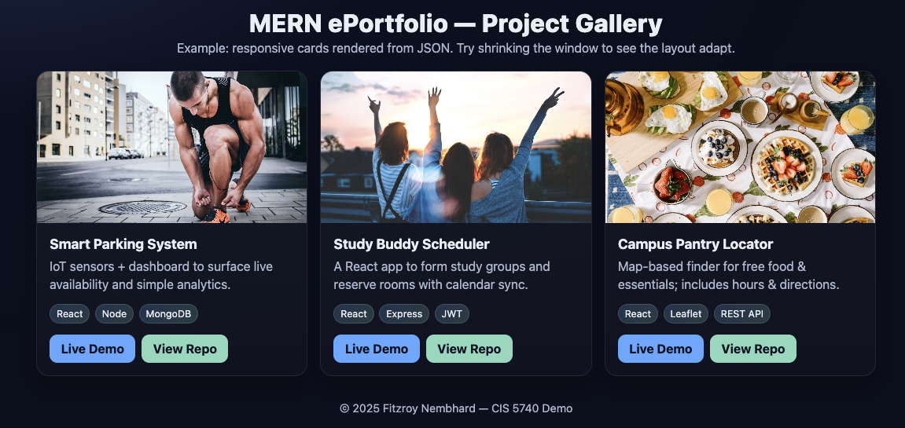

# 🎨 Responsive Project Cards with React

This project demonstrates how to build **responsive, accessible project cards** using **React** and **CSS Grid**.  
It’s designed as a **teaching demo** for web programming courses to help students understand reusable components, JSON-driven UIs, and responsive layouts.



---

## 🚀 Features
- 🧩 **React Components** — modular, reusable `ProjectCard` structure
- 🗂️ **Data from JSON** — projects rendered dynamically from a `.json` file
- 📱 **Responsive Grid Layout** — single column on mobile, multi-column on desktop
- 🦾 **Accessible (a11y)** — keyboard focus, alt text, proper semantics
- 🎨 **Gradient + Shadow Effects** — modern visual style with CSS variables
- 🌐 **Easy Deployment** — works seamlessly with Vite and Netlify

---

## 🧱 Project Structure
```
react-cards-demo/
├─ index.html
├─ package.json
├─ vite.config.js
└─ src/
   ├─ main.jsx
   ├─ App.jsx
   ├─ components/
   │  └─ ProjectCards.jsx
   ├─ data/
   │  └─ projects.json
   └─ styles.css
```


---

## 🧩 Technologies Used
| Area | Technology |
|------|-------------|
| Frontend | React 18 (Vite) |
| Styling | CSS Grid & Flexbox |
| Data | Local JSON file |
| Tooling | Node.js, npm, Vite |

---

## 🧠 Learning Objectives
By the end of this exercise, students will be able to:
1. Build reusable React components to display structured data.
2. Use `map()` to render lists dynamically from a JSON file.
3. Apply CSS Grid to create responsive layouts.
4. Implement hover and focus states for interactivity and accessibility.
5. Deploy a static React app using Vite (optional).

---

## ⚙️ Setup & Run

### 1. Clone the project
```bash
git clone https://github.com/fitzreatcs/react-cards-demo.git
cd react-cards-demo
```

### 2. Install dependencies
```
npm install
```

### 3. Start the Dev Server
```
npm run dev
```

## 🧾 Example Data
```
[
  {
    "id": "p1",
    "title": "Smart Parking System",
    "description": "IoT sensors + dashboard for live parking analytics.",
    "image": "https://images.unsplash.com/photo-1483721310020-03333e577078?q=80&w=1200&auto=format&fit=crop",
    "tech": ["React", "Node", "MongoDB"],
    "demoUrl": "https://example.com/parking",
    "repoUrl": "https://github.com/example/smart-parking"
  }
]
```

## 🧑‍💻 Accessibility (a11y) Highlights
* Keyboard focusable cards (tabIndex="0")
* Meaningful alt text for images
* Visible focus ring for keyboard users
* Semantic markup with <section> and <article>
* Sufficient color contrast and clear typography


## 🧰 Customization
* Add more projects to src/data/projects.json
* Update card visuals in src/styles.css
* Replace demo links with your real projects
* Try using TailwindCSS for utility-based styling (advanced exercise)

## 🌎 Deployment Options
| Platform                  | Pros                                                           | Cons                                            |
| ------------------------- | -------------------------------------------------------------- | ----------------------------------------------- |
| **Netlify**               | Simple drag-and-drop deploy, continuous deployment from GitHub | Slightly slower build times for large Vite apps |
| **Vercel**                | Auto-optimizations, supports React/Vite natively               | Limited free tier build minutes                 |
| **Render (Static Sites)** | Free static hosting, easy environment config                   | Slower initial cold starts                      |

